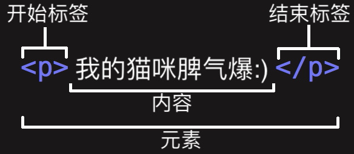

# 元素的概念

剖析一个 HTML 元素：


1. **开始标签**（Opening tag）：包含元素的名称（本例为 p），被左、右角括号所包围。表示元素从这里开始或者开始起作用 —— 在本例中即段落由此开始。
2. **结束标签**（Closing tag）：与开始标签相似，只是其在元素名之前包含了一个斜杠。这表示着元素的结尾 —— 在本例中即段落在此结束。初学者常常会犯忘记包含结束标签的错误，这可能会产生一些奇怪的结果。
3. **内容**（Content）：元素的内容，本例中就是所输入的文本本身。
4. **元素**（Element）：开始标签、结束标签与内容相结合，便是一个完整的元素。

## 嵌套元素

你也可以把元素放到其它元素之中——这被称作嵌套。

你需要确保元素被正确的嵌套

```
<p>我的猫咪脾气<strong>爆</strong>:)</p>
```

下面的例子是错误的：
```
<p>我的猫咪脾气<strong>爆:)</p></strong>
```

## 块元素 和 内联元素
- 在HTML中有两种你需要知道的重要元素类别，块级元素和内联元素。
- 块级元素在页面中以块的形式展现 —— 相对于其前面的内容它会出现在新的一行，其后的内容也会被挤到下一行展现。块级元素通常用于展示页面上结构化的内容，例如段落、列表、导航菜单、页脚等等。一个以block形式展现的块级元素不会被嵌套进内联元素中，但可以嵌套在其它块级元素中。
内联元素通常出现在块级元素中并环绕文档内容的一小部分，而不是一整个段落或者一组内容。内联元素不会导致文本换行：它通常出现在一堆文字之间例如超链接元素`<a>`或者强调元素`<em>`和 `<strong>`。