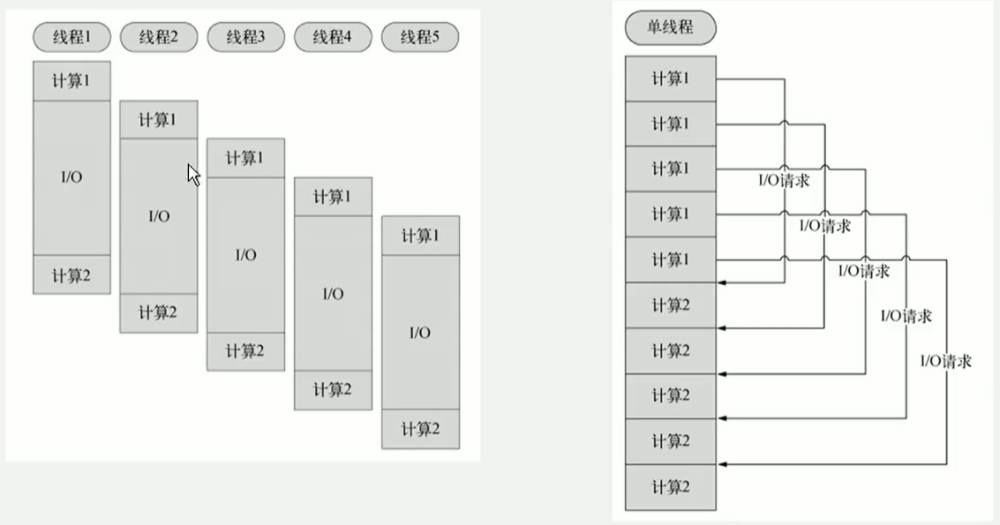
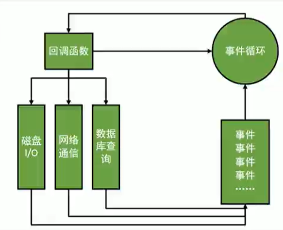

# nodejs概述

V8引擎本身就是用于Chrome浏览器的JS解析部分，但Ryan Dahl把V8搬到了服务器上，用于做服务器的软件。
这个人是一个专注于实现高性能web服务器优化的专家，几经探索，遇到V8而诞生了nodejs项目

Nodejs是一个让JavaScript运行在服务端的开发平台，它让JavaScript的触角伸到了服务端，可以与PHP、JSP、Python、Ruby平起平坐。
但node有些不同：
- Node不是一门新的编程语言，node使用javascript进行编程，运行在JavaScript引擎上（V8）
- 与其他后台原因相比，node跳过了一些HTTP服务器，自己不用建设在任何服务器之上。
- node与许多经典架构有这很大的不同，可以提供强大的伸缩能力

Node自身的哲学，是花最小的硬件成本，追求更高的并发，更高的处理性能。

## 单线程

nodejs不为每个用户创建一个新的线程，而仅仅使用一个线程。当有用户连接了，就触发一个内部事件，通过非阻塞IO、事件驱动机制，让nodejs在宏观上也是并行的。

使用nodejs，一台8GB的服务器，可以同时处理超过4万用户的连接

另外，单线程带来的好处，还有操作系统完全不再有线程的创建、销毁事件的开销

多线程与单线程的对比，单线程也能造成宏观上的并发

坏处，这个单线程崩溃了，所有的用户都不能正常访问了

## 非阻塞IO non-blocking I/O

IO阻塞了代码的执行，极大降低了程序的执行效率。

当某个IO执行完毕时，将以事件的形式通知执行IO操作的线程，线程执行这个事件的回调函数。
为了处理异步IO，线程必须有事件循环，不断的检查有没有未处理的事件，依次予以处理。

阻塞模式下，一个线程只能处理一项任务，要想提高吞吐量必须通过多线程。
**而非阻塞模式下，一个线程永远在执行计算操作，这个线程的CPU核心利用率永远是100%。**

所以，这是一种特别有哲理的解决方案：**与其人多，但是好多人闲着；还不如一个人玩命，往死里干！**

## 事件驱动 event-driven

在node中，客户端请求建立连接，提交数据等行为，会触发相应的事件。
在node中，在一个时刻，只能执行一个事件回调函数，但是在执行一个事件回调函数的中途，可以转而处理其他事件，然后返回继续执行原事件的回调函数，这种处理机制，称为**“事件环”**机制。

node底层是C++（V8也是C++写的）。底层代码中，近半数都用于事件队列、回调函数队列的构建。
用事件驱动来完成服务器的任务调度，这是鬼才般的设计。

## 三个特性的关系

- 单线程，减少了内存的开销，操作系统内存换页
- 如果某一个事情，被IO阻塞了，所以这个线程就被阻塞了
- 这个时候，就想到了，不该去等着IO结束，应该不管IO阻塞，去执行其他任务（需要非阻塞IO）
- 问题又来了，执行任务时，某个IO完成了，这个线程如何知道IO完成了呢（需要事件机制）

## node适合开发什么样的程序？

当应用程序需要处理大量并发的IO，而在想客户端发出响应之前，应用程序内部并不需要进行非常复杂的处理的时候，node非常适合。
node也非常适合于web socket配合，开发长连接的实时交互应用程序

擅长IO，不擅长计算。
擅长的是任务调度，如果计算任务阻塞了node的单线程，那么node也会变慢的。

## node与其他后台语言

node本身就是追求性能的一个产物，缺少很多服务器方面健壮性的考量。
所以node在很多需要高可靠性的业务中不可能使用。

node不是万能的，只是一个小工具而已。

