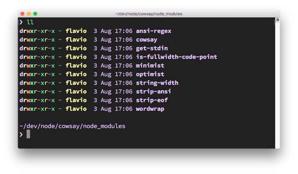
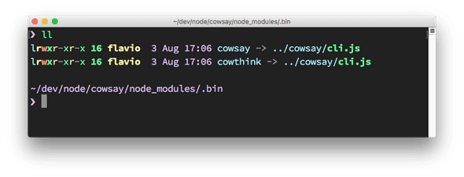
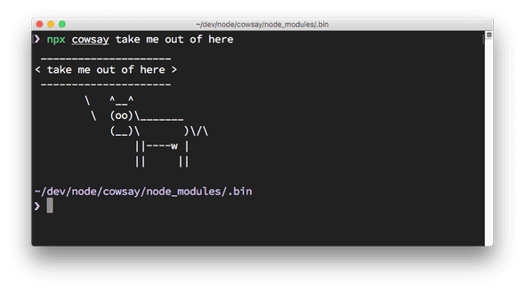

# 如何使用安装的包

当使用 `npm` 将软件包安装到 `node_modules` 文件夹中或全局安装时，如何在 Node.js 代码中使用它？

假设使用以下命令安装了流行的 JavaScript 实用工具库 `lodash`：

```bash
npm install lodash
```

这会把软件包安装到本地的 `node_modules` 文件夹中。

若要在代码中使用它，则只需使用 `require` 将其导入到程序中：

```javascript
const _ = require('lodash')
```

如果软件包是可执行文件，该怎么办？

在这种情况下，它会把可执行文件放到 `node_modules/.bin/` 文件夹下。

验证这一点的简单示例是 [cowsay](https://www.npmjs.com/package/cowsay)。

cowsay 软件包提供了一个命令行程序，可以执行该程序以使母牛说些话（以及其他动物也可以说话）。

当使用 `npm install cowsay` 安装软件包时，它会在 node_modules 文件夹中安装自身以及一些依赖包：

[](http://nodejs.cn/static/b245c50f5080dae16a2525fae0ba2c91/d2c2a/node_modules-content.png)

有一个隐藏的 .bin 文件夹，其中包含指向 cowsay 二进制文件的符号链接：

[](http://nodejs.cn/static/99830aefa055e247397de544ad7b7744/d2c2a/binary-files.png)

如何执行这些文件？

可以输入 `./node_modules/.bin/cowsay` 来运行它，但是最新版本的 npm（自 5.2 起）中包含的 npx 是更好的选择。 只需运行：

```sh
npx cowsay
```

则 npx 会找到程序包的位置。

[](http://nodejs.cn/static/ad4f3d3a7464bb0f8a2845fe8e6588c2/d2c2a/cow-say.png)