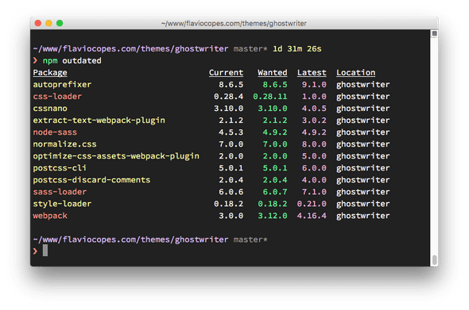

# 将所有依赖包更新到最新版本

当使用 `npm install <packagename>` 安装软件包时，该软件包最新的可用版本会被下载并放入 `node_modules` 文件夹中，并且还会将相应的条目添加到当前文件夹中存在的 `package.json` 和 `package-lock.json` 文件中。

npm 会核计依赖，并安装这些依赖最新的可用版本。

假设要安装 [`cowsay`](https://www.npmjs.com/package/cowsay)，这是一个很酷的命令行工具，可以让母牛说话。

当 `npm install cowsay` 时，此条目会被添加到 `package.json` 文件中：

```json
{
  "dependencies": {
    "cowsay": "^1.3.1"
  }
}
```

以下是 `package-lock.json` 的片段，为方便查看，在其中删除了嵌套的依赖：

```json
{
  "requires": true,
  "lockfileVersion": 1,
  "dependencies": {
    "cowsay": {
      "version": "1.3.1",
      "resolved": "https://registry.npmjs.org/cowsay/-/cowsay-1.3.1.tgz",
      "integrity": "sha512-3PVFe6FePVtPj1HTeLin9v8WyLl+VmM1l1H/5P+BTTDkMAjufp+0F9eLjzRnOHzVAYeIYFF5po5NjRrgefnRMQ==",
      "requires": {
        "get-stdin": "^5.0.1",
        "optimist": "~0.6.1",
        "string-width": "~2.1.1",
        "strip-eof": "^1.0.0"
      }
    }
  }
}
```

现在，这两个文件告诉我们，已安装了 cowsay 的 `1.3.1` 版本，并且更新的规则是 `^1.3.1`（这对于 npm 版本控制规则意味着 npm 可以更新到补丁版本和次版本：即 `1.3.2`、`1.4.0`、依此类推）。

如果有新的次版本或补丁版本，并且输入了 `npm update`，则已安装的版本会被更新，并且 `package-lock.json` 文件会被新版本填充。

`package.json` 则保持不变。

若要发觉软件包的新版本，则运行 `npm outdated`。

以下是一个仓库中一些过时的软件包的列表，该仓库已很长时间没有更新：

[](http://nodejs.cn/static/e967736f8d105e64c22d80ce7a42f52a/ee455/outdated-packages.png)

这些更新中有些是主版本。 运行 `npm update` 不会更新那些版本。 主版本永远不会被这种方式更新，因为它们（根据定义）会引入重大的更改，`npm` 希望为你减少麻烦。

若要将所有软件包更新到新的主版本，则全局地安装 `npm-check-updates` 软件包：

```sh
npm install -g npm-check-updates
```

然后运行：

```sh
ncu -u
```

这会升级 `package.json` 文件的 `dependencies` 和 `devDependencies` 中的所有版本，以便 npm 可以安装新的主版本。

现在可以运行更新了：

```sh
npm update
```

如果只是下载了项目还没有 `node_modules` 依赖包，并且想先安装新的版本，则运行：

```sh
npm install
```