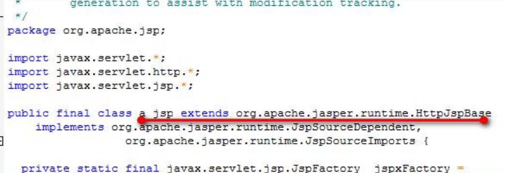
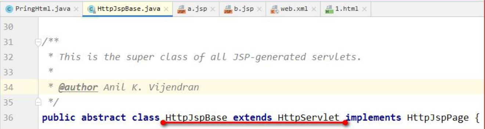

# JSP介绍

JSP(全称 Java Server Pages)是由 Sun 公司专门为了解决动态生成 HTML 文档的技术。
在学习 jsp 技术之前，如果我们要往客户端输出一个页面。我们可以使用 Servlet 程序来实现。

通过 Servlet 输出简单的 html 页面信息都非常不方便。
那我们要输出一个复杂页面的时候，就更加的困难，而且不利于页面的维护和调试。
所以 sun 公司推出一种叫做 jsp 的动态页面技术帮助我们实现对页面的输出繁锁工作。

jsp 页面和 html 页面一样，都是存放在 web 目录下。访问也跟访问 html 页面一样。

## JSP的本质

jsp 页面本质上是一个 Servlet 程序。

当我们第一次访问 jsp 页面的时候。
Tomcat 服务器会帮我们把 jsp 页面翻译成为一个 java 源文件。
并且对它进行编译成 为.class 字节码程序。

我们打开 java 源文件不难发现其里面的内容是：

我们跟踪原代码发现，HttpJspBase 类。它直接地继承了 HttpServlet 类。
也就是说。jsp 翻译出来的 java 类，它间接了继 承了 HttpServlet 类。
也就是说，翻译出来的是一个 Servlet 程序

总结：通过翻译的 java 源代码我们就可以得到结果：jsp 就是 Servlet 程序。

也可以去观察翻译出来的 Servlet 程序的源代码，不难发现。其底层实现，也是通过输出流。把 html 页面数据回传 给客户端

