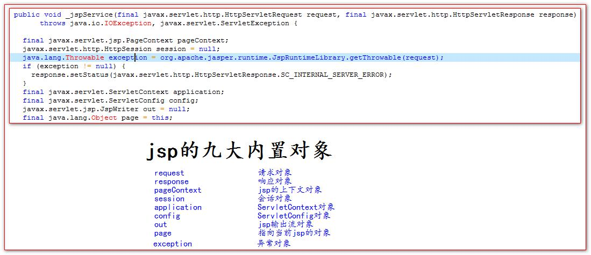
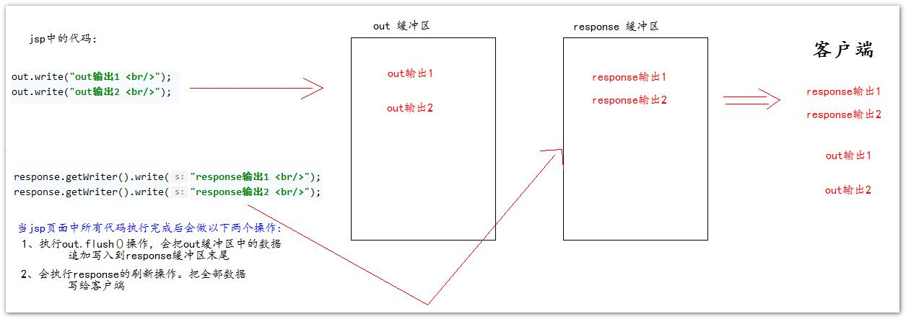
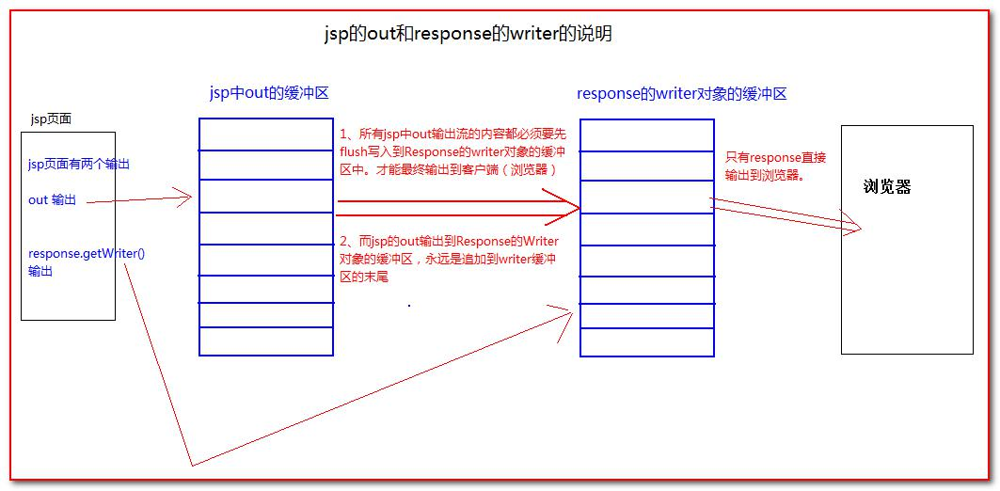

# 内置对象

jsp 中的内置对象，是指 Tomcat 在翻译 jsp 页面成为 Servlet 源代码后，内部提供的九大对象，叫内置对象。

## 四大作用域对象

## out 与 response.getWriter

response 中表示响应，我们经常用于设置返回给客户端的内容（输出） 
out 也是给用户做输出使用的。

由于 jsp 翻译之后，底层源代码都是使用 out 来进行输出，
所以一般情况下。我们在 jsp 页面中统一使用 out 来进行输出。避 免打乱页面输出内容的顺序。

out.write() 输出字符串没有问题
out.print() 输出任意数据都没有问题（都转换成为字符串后调用的 write 输出）

深入源码，浅出结论：在 jsp 页面中，可以统一使用 out.print()来进行输出
