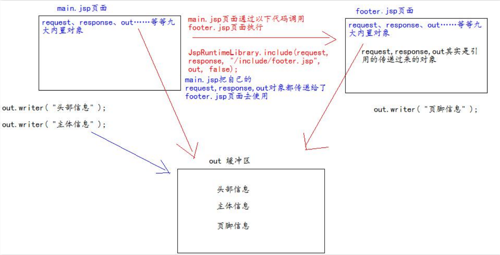

# 页面包含

## 静态包含

`<%@ include file=""%>` 就是静态包含
file 属性指定你要包含的 jsp 页面的路径
地址中第一个斜杠 / 表示为 http://ip:port/工程路径/ 映射到代码的 web 目录

静态包含的特点：
- 静态包含不会翻译被包含的 jsp 页面。
- 静态包含其实是把被包含的 jsp 页面的代码拷贝到包含的位置执行输出。

## 动态包含

`<jsp:include page=""></jsp:include>` 这是动态包含
page 属性是指定你要包含的 jsp 页面的路径
动态包含也可以像静态包含一样。把被包含的内容执行输出到包含位置

动态包含的特点：
- 动态包含会把包含的 jsp 页面也翻译成为 java 代码
- 动态包含底层代码使用如下代码去调用被包含的 jsp 页面执行输出。
    - `JspRuntimeLibrary.include(request, response, "/include/footer.jsp", out, false);`
- 动态包含，还可以传递参数

动态包含底层原理：
