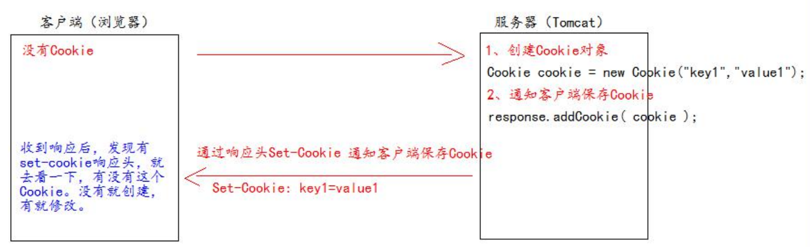
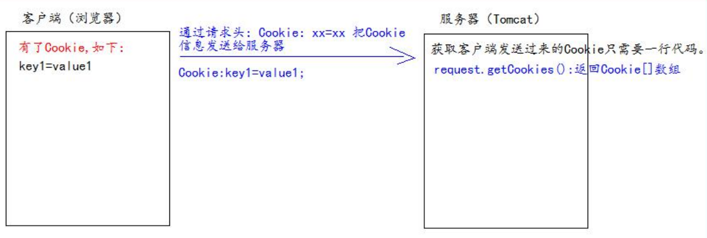
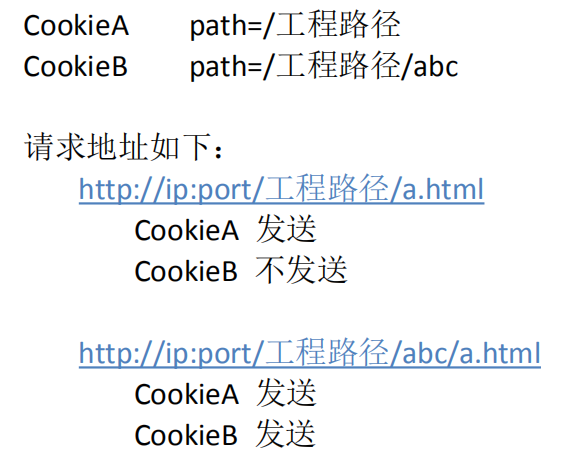
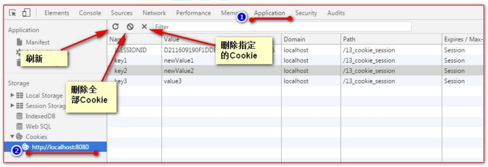
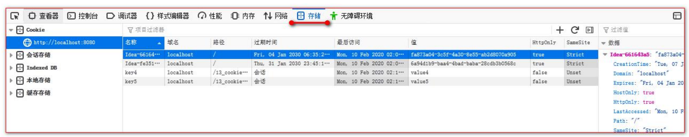
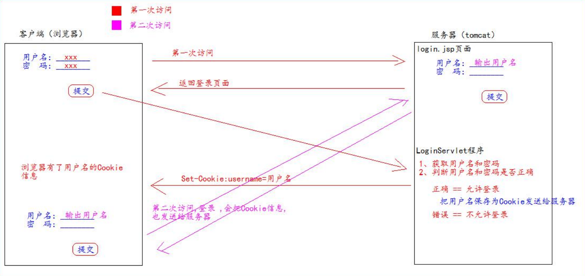

# Cookie 小饼干

Cookie 翻译过来是饼干的意思
Cookie 是服务器通知客户端保存键值对的一种技术
客户端有了 Cookie 后，每次请求都发送给服务器
每个 Cookie 的大小不能超过 4kb

## 如何创建Cookie

## 服务器如何获取Cookie

## 修改Cookie

先创建一个要修改的同名（指的就是 key）的 Cookie 对象
在构造器，同时赋于新的 Cookie 值
调用 response.addCookie( Cookie );

方案二：
先查找到需要修改的 Cookie 对象
调用 setValue()方法赋于新的 Cookie 值
调用 response.addCookie()通知客户端保存修改

## Cookie 生命控制

Cookie 的生命控制指的是如何管理 Cookie 什么时候被销毁（删除）

setMaxAge()：
- 正数，表示在指定的秒数后过期
- 负数，表示浏览器一关，Cookie 就会被删除（默认值是-1）
- 零，表示马上删除 Cookie

## Cookie 有效路径 Path 的设置

Cookie 的 path 属性可以有效的过滤哪些 Cookie 可以发送给服务器。哪些不发。
path 属性是通过请求的地址来进行有效的过滤。

## 浏览器查看Cookie

谷歌浏览器

火狐浏览器：

## Cookie练习，免输入用户名登录

