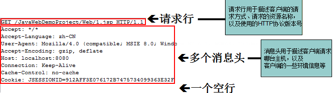

# HTTP了解

HTTP：超文本传输协议，是请求-响应协议，通常运行在TCP之上，默认端口80

HTTPS：安全的HTTP，默认端口443

## 两个时代

HTTP1.0：
- HTTP/1.0：客户端可以与web服务器连接后，只能获取一个web资源，断开连接

HTTP2.0
- HTTP/1.1：连接之后，可以获得多个web资源，可以保持一段时间的连接

## HTTP请求

客户端发请求到服务器

客户端连上服务器后，向服务器请求某个web资源，称之为客户端向服务器发送了一个HTTP请求。

一个完整的HTTP请求包括如下内容：一个请求行、若干消息头、以及实体内容


- GET请求方式：请求能够携带的参数比较少，大小有限制，会在浏览器的URL地址栏显示数据内容，不安全，但是高效
- POST请求方式：请求携带的参数没有限制，大小没有限制，不会在URL中显示数据内容，安全，不高效（不是大问题）
- 。。。。。。

请求行：
```
请求行中的GET称之为请求方式，请求方式有：POST、GET、HEAD、OPTIONS、DELETE、TRACE、PUT，常用的有： GET、 POST
　　用户如果没有设置，默认情况下浏览器向服务器发送的都是get请求，
　　例如在浏览器直接输地址访问，点超链接访问等都是get，用户如想把请求方式改为post，可通过更改表单的提交方式实现。
　　不管POST或GET，都用于向服务器请求某个WEB资源，这两种方式的区别主要表现在数据传递上：
　　    如果请求方式为GET方式，则可以在请求的URL地址后以?的形式带上交给服务器的数据，
　　    多个数据之间以&进行分隔，例如：GET /mail/1.html?name=abc&password=xyz HTTP/1.1
　　GET方式的特点：在URL地址后附带的参数是有限制的，其数据容量通常不能超过1K。
　　如果请求方式为POST方式，则可以在请求的实体内容中向服务器发送数据，Post方式的特点：传送的数据量无限制。
```

HTTP请求常用消息头：
```
accept: 浏览器通过这个头告诉服务器，它所支持的数据类型
Accept-Charset: 浏览器通过这个头告诉服务器，它支持哪种字符集
Accept-Encoding： 浏览器通过这个头告诉服务器，支持的压缩格式
Accept-Language： 浏览器通过这个头告诉服务器，它的语言环境
Host： 浏览器通过这个头告诉服务器，想访问哪台主机
If-Modified-Since:  浏览器通过这个头告诉服务器，缓存数据的时间
Referer： 浏览器通过这个头告诉服务器，客户机是哪个页面来的  防盗链
Connection： 浏览器通过这个头告诉服务器，请求完后是断开链接还是何持链接
```

## HTTP响应

服务器响应内容给客户端

常见响应头：
```
```

常见响应体：
```
```

响应状态码：
- 200：请求响应成功
- 3xx：请求重定向
- 4xx：找不到资源
- 5xx：服务器代码错误