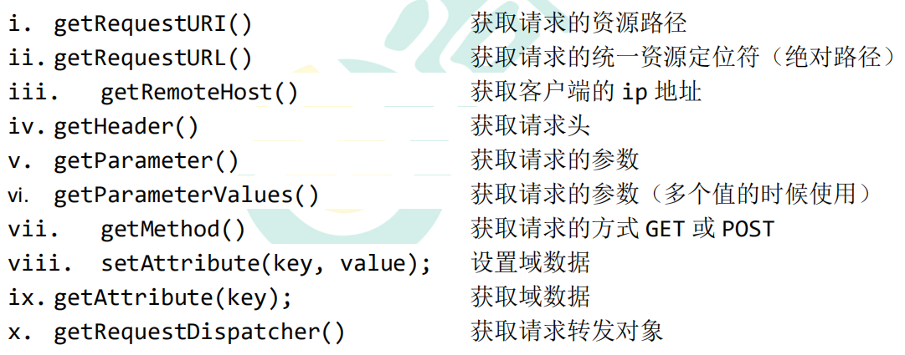

# HttpServletRequest 请求

每次只要有请求进入 Tomcat 服务器，Tomcat 服务器就会把请求过来的 HTTP 协议信息解析好封装到 Request 对象中。 
然后传递到 service 方法（doGet 和 doPost）中给我们使用。
我们可以通过 HttpServletRequest 对象，获取到所有请求的 信息。

## 几个常用方法


## 如何获取请求参数


## doGet请求的中文乱码解决

```java
// 获取请求参数
String username = req.getParameter("username");
//1 先以 iso8859-1 进行编码
//2 再以 utf-8 进行解码
username = new String(username.getBytes("iso-8859-1"), "UTF-8");
```

## doPost请求的中文乱码解决

```java
@Override protected void doPost(HttpServletRequest req, HttpServletResponse resp) throws ServletException, IOException {
    // 设置请求体的字符集为 UTF-8，从而解决 post 请求的中文乱码问题
    req.setCharacterEncoding("UTF-8");
    System.out.println("-------------doPost------------");
    // 获取请求参数
    String username = req.getParameter("username");
    String password = req.getParameter("password");
    String[] hobby = req.getParameterValues("hobby");
    System.out.println("用户名：" + username);
    System.out.println("密码：" + password);
    System.out.println("兴趣爱好：" + Arrays.asList(hobby)); 
}
```

## 请求转发

请求转发是指，服务器收到请求后，从一次资源跳转到另一个资源的操作叫请求转发。


## base 标签


