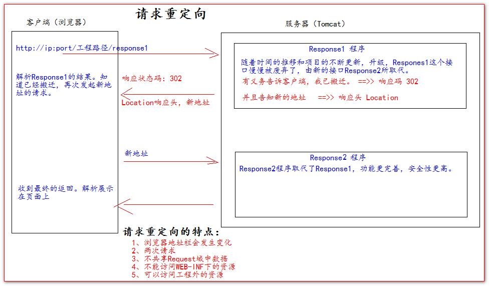

# HttpServletResponse 响应

每次请求进来，Tomcat 服务器都会创建一个 Response 对象传 递给 Servlet 程序去使用。
HttpServletRequest 表示请求过来的信息，HttpServletResponse 表示所有响应的信息，
我们如果需要设置返回给客户端的信息，都可以通过 HttpServletResponse 对象来进行设置

## 两个输出流

- 字节流：getOutputStream() 常用于下载（传递二进制数据）
- 字符流：getWriter() 常用于回传字符串（常用）

> 注：这两个流只能同时使用一个

## 响应的乱码

解决方法一：
```java
// 设置服务器字符集为 UTF-8
resp.setCharacterEncoding("UTF-8");
// 通过响应头，设置浏览器也使用 UTF-8 字符集
resp.setHeader("Content-Type", "text/html; charset=UTF-8");
```

## 请求重定向

请求重定向，是指客户端给服务器发请求，然后服务器告诉客户端说。
我给你一些地址。你去新地址访问。
叫请求 重定向（因为之前的地址可能已经被废弃）。



请求重定向的第一种方案：
```java
// 设置响应状态码 302 ，表示重定向，（已搬迁） 
resp.setStatus(302); 
// 设置响应头，说明 新的地址在哪里 
resp.setHeader("Location", "http://localhost:8080");
```

请求重定向的第二种方案：
```java
resp.sendRedirect("http://localhost:8080");
```

## 下载文件

1. 获取要下载文件的路径
2. 下载文件的文件名
3. 让浏览器支持我们要下载的东西
4. 获取下载文件的输入流
5. 创建缓冲区
6. 获取OutputStream对象
7. 将FileInputStream流写入到buffer缓冲区
8. 使用OutputStream将缓冲区中的数据输出到客户端

```java
@Override
protected void doGet(HttpServletRequest req, HttpServletResponse resp) throws ServletException, IOException {
    //1. 获取要下载文件的路径
    String realPath = "F:\\project\\IDEA\\ServletAndJsp\\ServletDemo01\\target\\classes\\1.jpg";
    //2. 下载文件的文件名
    String filename = realPath.substring(realPath.lastIndexOf("\\") + 1);
    //3. 让浏览器支持我们要下载的东西
    resp.setHeader("Content-Disposition", "attachment;filename=" + filename);
    //4. 获取下载文件的输入流
    FileInputStream in = new FileInputStream(realPath);
    //5. 创建缓冲区
    int len = 0;
    byte[] buffer = new byte[1024];
    //6. 获取OutputStream对象
    ServletOutputStream out = resp.getOutputStream();
    //7. 将FileInputStream流写入到buffer缓冲区
    while((len = in.read(buffer)) > 0) {
        out.write(buffer, 0, len);
    }
    //8. 使用OutputStream将缓冲区中的数据输出到客户端
    out.flush();
    //9. 关闭资源
    in.close();
}
```
