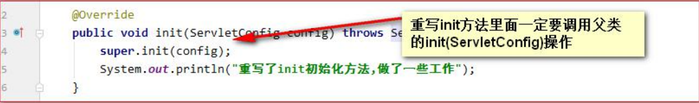

# ServletConfig

ServletConfig 类从类名上来看，就知道是 Servlet 程序的配置信息类。
Servlet 程序和 ServletConfig 对象都是由 Tomcat 负责创建，我们负责使用。 
Servlet 程序默认是第一次访问的时候创建，ServletConfig 是每个 Servlet 程序创建时，就创建一个对应的 ServletConfig 对 象。

## ServletConfig的三个作用

1、可以获取 Servlet 程序的别名 servlet-name 的值
2、获取初始化参数 init-param
3、获取 ServletContext 对象

```xml
<!--init-param 是初始化参数-->
<init-param>
    <!--是参数名-->
    <param-name>username</param-name>
    <!--是参数值-->
    <param-value>root</param-value>
</init-param>

<!--init-param 是初始化参数-->
<init-param>
    <!--是参数名-->
    <param-name>url</param-name>
    <!--是参数值-->
    <param-value>jdbc:mysql://localhost:3306/test</param-value>
</init-param>
```

获取Servlet的别名：`servletConfig.getServletName()`
获取配置的参数值：`servletConfig.getInitParameter("xxx")`
获取ServletContext对象：`servletConfig.getServletContext()`

## 注意


