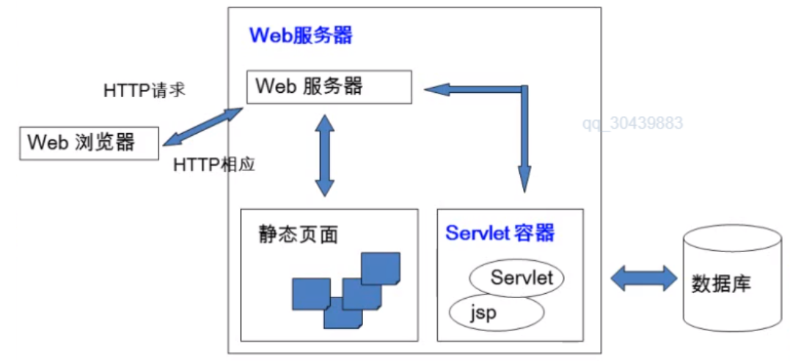

# Servlet介绍

Servlet是一种用于开发动态Web的技术

Servlet容器的概念：
> Servlet容器为JavaWeb应用提供运行时环境，它负责管理Servlet和JSP的生命周期，以及管理他们的共享数据

Servlet容器也称JavaWeb应用容器，或者Servlet/JSP容器

1、Servlet 是 JavaEE 规范之一。规范就是接口
2、Servlet 就 JavaWeb 三大组件之一。三大组件分别是：Servlet 程序、Filter 过滤器、Listener 监听器。
3、Servlet 是运行在服务器上的一个 java 小程序，它可以接收客户端发送过来的请求，并响应数据给客户端。

Servlet就是Sun公司开发动态web的一门技术
Sun在这些API中提供了一个接口叫做Servlet，

如果要开发一个Servlet程序，分为两个步骤：、
- 编写一个类，实现Servlet接口
- 把开发好的Java类部署到web服务器中

把实现了Servlet接口的Java程序叫做 Servlet

