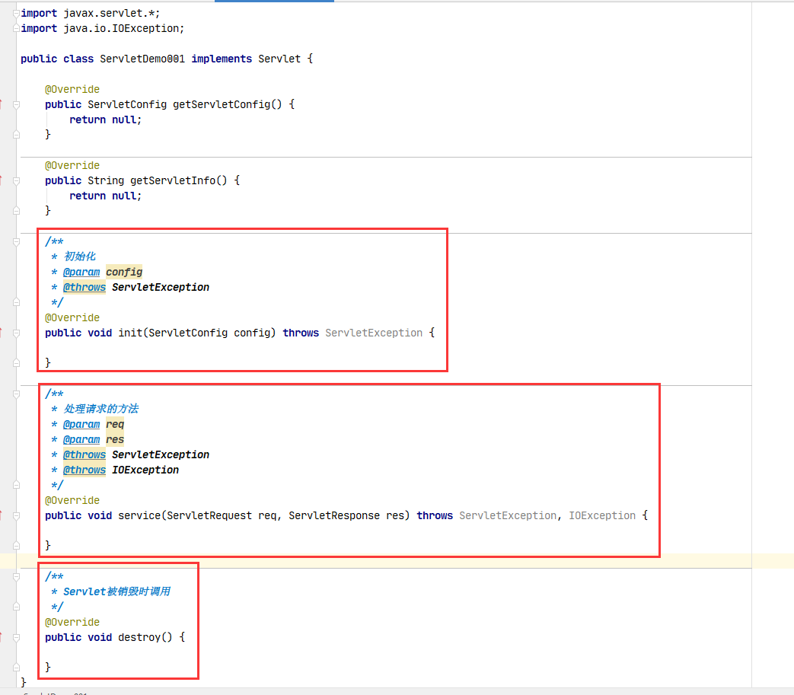

# Servlet接口的方法

## init方法

初始化方法，当Servlet第一次被加载的时候（通常是第一次被请求的时候）执行这个方法

这个方法只会执行一次

## service方法

每次接收到请求，都会执行service方法

## destroy方法

当Servlet被销毁（即web服务器正常关闭时）会执行destroy方法

---

## getServletConfig

## getServletInfo