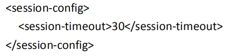
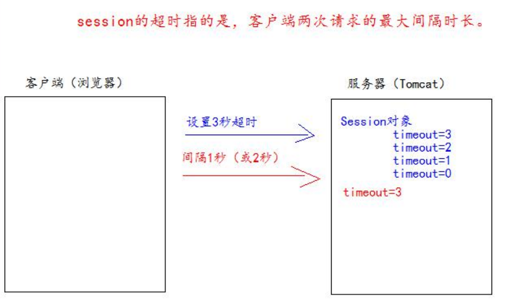
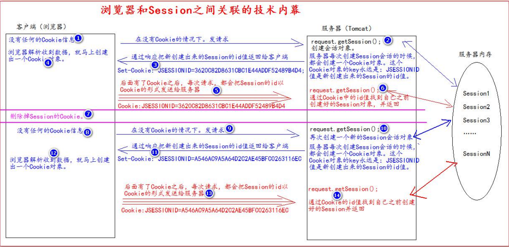

# Session 会话

Session 就一个接口（HttpSession）
Session 就是会话。它是用来维护一个客户端和服务器之间关联的一种技术。
每个客户端都有自己的一个 Session 会话。
Session 会话中，我们经常用来保存用户登录之后的信息。

服务器会给每一个用户创建一个Session

## 创建Session

`request.getSession()`
- 第一次调用是：创建 Session 会话
- 之后调用都是：获取前面创建好的 Session 会话对象。

`isNew()`; 判断到底是不是刚创建出来的（新的）
- true 表示刚创建
- false 表示获取之前创建

每个会话都有一个身份证号。也就是 ID 值。而且这个 ID 是唯一的。
`getId()` 得到 Session 的会话 id 值。

## Session域数据存取

## Session生命周期

`public void setMaxInactiveInterval(int interval)`
- 设置 Session 的超时时间（以秒为单位），超过指定的时长，Session 就会被销毁。
- 值为正数的时候，设定 Session 的超时时长。 负数表示永不超时（极少使用）

`public int getMaxInactiveInterval()`：获取 Session 的超时时间

`public void invalidate()` 让当前 Session 会话马上超时无效。

Session 默认的超时时长是多少！
Session 默认的超时时间长为 30 分钟。
因为在 Tomcat 服务器的配置文件 web.xml中默认有以下的配置，它就表示配置了当前 Tomcat 服务器下所有的 Session 超时配置默认时长为：30 分钟。



如果说。你希望你的 web 工程，默认的 Session 的超时时长为其他时长。
你可以在你自己的 web.xml 配置文件中做 以上相同的配置。
就可以修改你的 web 工程所有 Seession 的默认超时时长。
```xml
<!--表示当前 web 工程。创建出来 的所有 Session 默认是 20 分钟 超时时长-->
<session-config>
    <session-timeout>20</session-timeout>
</session-config>
```

如果你想只修改个别 Session 的超时时长。就可以使用上面的 API。
setMaxInactiveInterval(int interval)来进行单独的设 置。
session.setMaxInactiveInterval(int interval)单独设置超时时长

## Session超时


## 浏览器和Session的关联

Session 技术，底层其实是基于 Cookie 技术来实现的。


