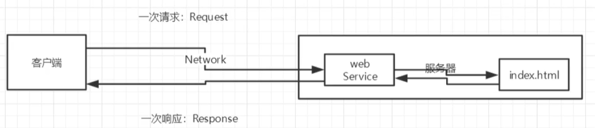
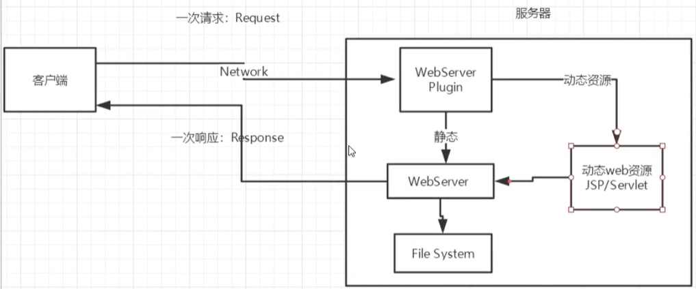
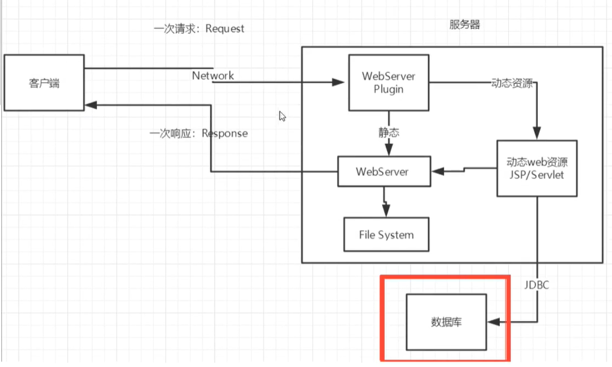
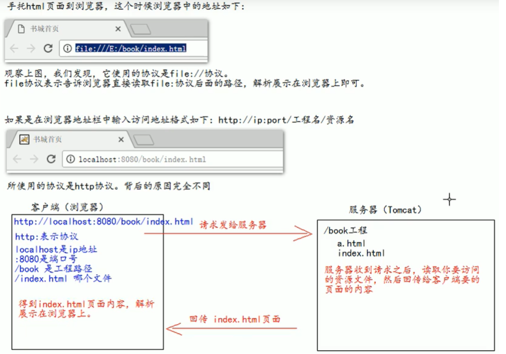

# web应用的一些概念

WEB，在英语中web即表示网页的意思，它用于表示Internet主机上供外界访问的资源。　Internet上供外界访问的Web资源分为：
1. **静态web资源（如html 页面）：指web页面中供人们浏览的数据始终是不变。**
2. **动态web资源：指web页面中供人们浏览的数据是由程序产生的，不同时间点访问web页面看到的内容各不相同**。

静态web资源开发技术：Html　常用动态web资源开发技术：JSP/Servlet、ASP、PHP等　在Java中，动态web资源开发技术统称为Javaweb。

在Sun的Java Servlet规范中，对Java Web应用作了这样的定义：“Java Web应用由一组Servlet、HTML页、类、以及其它可以被绑定的资源构成。它可以在各种供应商提供的实现Servlet规范的Servlet容器中运行”

JavaWeb应用中可以包含以下内容：

- Servlet
- JSP
- 实用类
- 静态文档，如HTML、图片等
- 描述web应用的信息（web.xml）

WEB应用程序指供浏览器访问的程序，通常也简称为web应用。例如有a.html 、b.html…..多个web资源，这多个web资源用于对外提供服务，此时应把这多个web资源放在一个目录中，以组成一个web应用（或web应用程序）　一个web应用由多个静态web资源和动态web资源组成，如:html、css、js文件，Jsp文件、java程序、支持jar包、配置文件等等。

**Web应用开发好后，若想供外界访问，需要把web应用所在目录交给web服务器管理，这个过程称之为虚似目录的映射**

## 静态web 与 动态web

静态web存在的缺点：
- web页面无法动态更新，所有用户看到的都是同一个页面
- 无法与数据库交互（数据无法持久化，用户无法互动）

动态web：页面的展示因人而异，取决于服务器逻辑

动态web的缺点：
- 假如服务器的动态web资源出现了错误，我们就要重新编写后台程序，重新发布

动态web的优点：
- 可以动态更新
- 可以与数据库交互（数据持久化）

