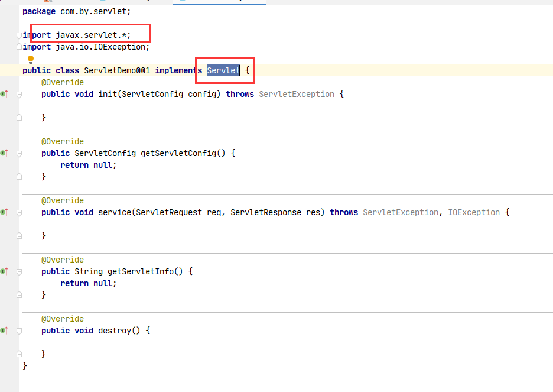
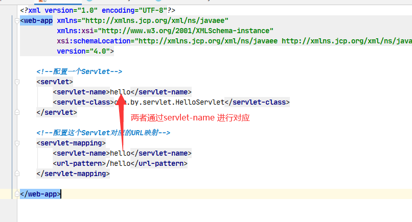
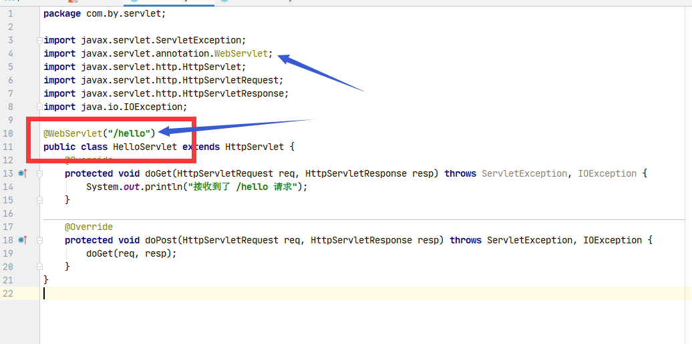

# 写一个基本的Servlet（实现Servlet接口）

创建一个普通类，实现Servlet接口




## 在web.xml中配置Servlet



```xml
<!-- servlet 标签给 Tomcat 配置 Servlet 程序 -->
<servlet>
    <!--servlet-name 标签 Servlet 程序起一个别名（一般是类名） -->
    <servlet-name>HelloServlet</servlet-name>
    <!--servlet-class 是 Servlet 程序的全类名-->
    <servlet-class>com.atguigu.servlet.HelloServlet</servlet-class>
</servlet>

<!--servlet-mapping 标签给 servlet 程序配置访问地址-->
    <servlet-mapping>
    <!--servlet-name 标签的作用是告诉服务器，我当前配置的地址给哪个 Servlet 程序使用-->
    <servlet-name>HelloServlet</servlet-name>
    <!--
        url-pattern 标签配置访问地址
        / 斜杠在服务器解析的时候，表示地址为：http://ip:port/工程路径
        /hello 表示地址为：http://ip:port/工程路径/hello
    -->
    <url-pattern>/hello</url-pattern>
</servlet-mapping>
```

## 注解方式配置Servlet



## 启动项目

启动tomcat，部署项目之后，通过访问 `xxx/hello` 即可请求到这个 Servlet
