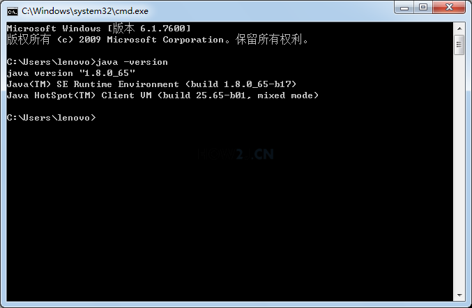

# JDK的安装与配置

下载：

如果下载的是压缩包，直接解压放到一个位置即可，
如果下载的安装程序，则需要手动点击安装，选择安装位置

右键我的电脑->属性->高级->环境变量->系统变量
注意：是下面的系统变量，不是上面的用户变量
新建变量名 JAVA_HOME，变量值 E:\JDK
修改变量 Path ，在最前面加上 %JAVA_HOME%\bin;
注意："Path"是首字母大写，不要改成"PATH" bin后面要有分号;
注意：系统变量上面的用户变量里，不要有这两个，如果有应该去掉，以避免被干扰。
注意：Win10 下PATH的配置有所不同

总结配置环境变量：
- `JAVA_HOME`：jdk存放的位置路径
- `PATH`：jdk下bin目录的路径
- `CLASSPATH`：当前路径 `.` 和 jdk下 lib 目录的路径

验证是否配置成功：
- 点WIN键->运行（或者使用win+r)
- 输入cmd命令
- 输入`java -version` 注： -version是小写，不能使用大写，java后面有一个空格
- 如果显示出正确的jdk版本信息，则说明配置成功
