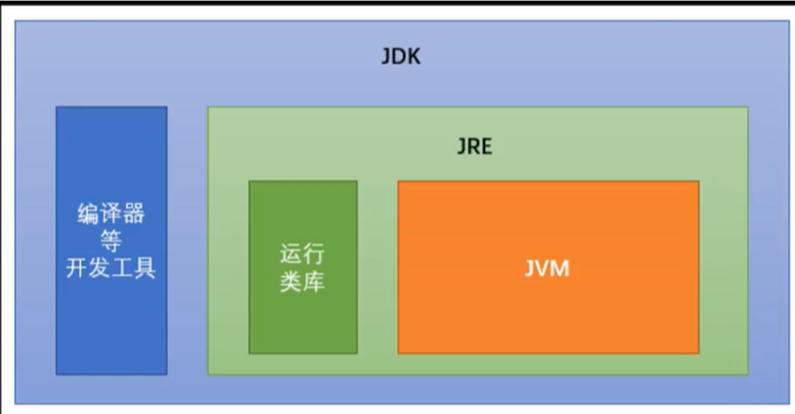

# JVM & JDK & JRE 的概念

# JDK 、 JRE

JRE：Java Runtime Environment：是Java程序的运行环境，包含JVM和运行时所需要的核心类库

JDK：Java Development Kit：是Java的开发工具包，包含JRE和开发人员使用的工具

我们想要运行一个Java程序，只需要安装JRE即可

我们想要开发一个Java程序，则必须安装JDK

JDK 是 Java Development Kit，它是功能齐全的 Java SDK。它拥有 JRE 所拥有的一切，还有编译器（javac）和工具（如 javadoc 和 jdb）。它能够创建和编译程序。

JRE 是 Java 运行时环境。它是运行已编译 Java 程序所需的所有内容的集合，包括 Java 虚拟机（JVM），Java 类库，java 命令和其他的一些基础构件。但是，它不能用于创建新程序。

如果你只是为了运行一下 Java 程序的话，那么你只需要安装 JRE 就可以了。如果你需要进行一些 Java 编程方面的工作，那么你就需要安装 JDK 了。但是，这不是绝对的。有时，即使您不打算在计算机上进行任何 Java 开发，仍然需要安装 JDK。例如，如果要使用 JSP 部署 Web 应用程序，那么从技术上讲，您只是在应用程序服务器中运行 Java 程序。那你为什么需要 JDK 呢？因为应用程序服务器会将 JSP 转换为 Java servlet，并且需要使用 JDK 来编译 servlet。

# JVM

Java 虚拟机（JVM）是运行 Java 字节码的虚拟机。
JVM 有针对不同系统的特定实现（Windows，Linux，macOS），目的是使用相同的字节码，它们都会给出相同的结果。

> Java 虚拟机（JVM）是运行 Java 字节码的虚拟机。JVM 有针对不同系统的特定实现（Windows，Linux，macOS），目的是使用相同的字节码，它们都会给出相同的结果。字节码和不同系统的 JVM 实现是 Java 语言“一次编译，随处可以运行”的关键所在。

# 什么是字节码，有什么好处？

> 在 Java 中，JVM 可以理解的代码就叫做字节码（即扩展名为 .class 的文件），它不面向任何特定的处理器，只面向虚拟机。Java 语言通过字节码的方式，在一定程度上解决了传统解释型语言执行效率低的问题，同时又保留了解释型语言可移植的特点。所以 Java 程序运行时比较高效，而且，由于字节码并不针对一种特定的机器，因此，Java 程序无须重新编译便可在多种不同操作系统的计算机上运行。

