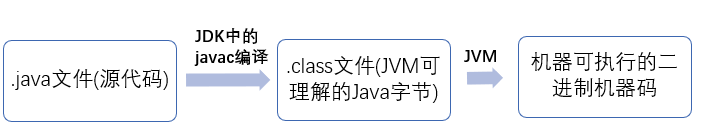

# Java程序开发的基本流程



我们需要格外注意的是 .class->机器码 这一步。在这一步 JVM 类加载器首先加载字节码文件，然后通过解释器逐行解释执行，这种方式的执行速度会相对比较慢。而且，有些方法和代码块是经常需要被调用的(也就是所谓的热点代码)，所以后面引进了 JIT 编译器，而 JIT 属于运行时编译。当 JIT 编译器完成第一次编译后，其会将字节码对应的机器码保存下来，下次可以直接使用。而我们知道，机器码的运行效率肯定是高于 Java 解释器的。这也解释了我们为什么经常会说 Java 是编译与解释共存的语言。

> HotSpot 采用了惰性评估(Lazy Evaluation)的做法，根据二八定律，消耗大部分系统资源的只有那一小部分的代码（热点代码），而这也就是 JIT 所需要编译的部分。JVM 会根据代码每次被执行的情况收集信息并相应地做出一些优化，因此执行的次数越多，它的速度就越快。JDK 9 引入了一种新的编译模式 AOT(Ahead of Time Compilation)，它是直接将字节码编译成机器码，这样就避免了 JIT 预热等各方面的开销。JDK 支持分层编译和 AOT 协作使用。但是 ，AOT 编译器的编译质量是肯定比不上 JIT 编译器的。

# 编写一个java程序并使用命令行来运行

新建一个文件 `HelloWorld.java`

用文本编辑器打开文件，输入以下内容：
```java
public class HelloWorld{
  public static void main(String[] args){
    System.out.println("hello world");
  }
}
```

> 因为java 是面向对象的编程语言，所以我们实际上是在创建一个个的类
> class HelloWorld 表示这个类的名字是HelloWorld
> public static void main(String[] args) 这是主方法，所有代码的入口
> System.out.println("hello world"); 表示在控制台（黑屏幕）输出一个字符串“hello world”

`.java` 文件是java的源文件，但是不能直接运行，必须先被编译成为`.class`文件 才能够执行
java 使用 javac命令进行编译  `javac XXX.java`

执行完成之后，目录下会生成一个对应的class文件

运行java类的方法是：`java classname`

# 类初识

java所有的代码都是运行在类里面的
public 表示这是一个可以公开访问的类
class 表示这是一个类
HelloWorld 表示类的名字，每个单词的首字母大写
你会写很多代码，总有第一行执行的代码，这就是主方法
args 表示运行参数，在本例中没有使用到。

# 控制台输出

System.out.println("hello world");
如果使用 `System.out.print()` 则表示不换行

