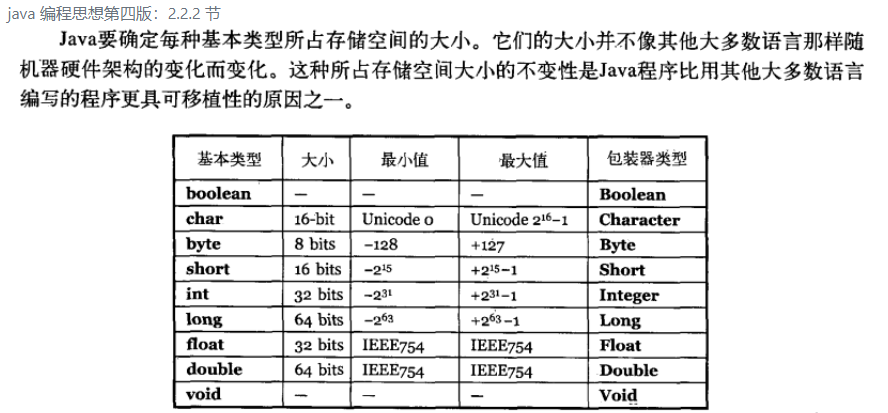

# 基本类型

Java的基本类型，主要分为四类八种：
- 整数类：`byte、int、short、long`
- 浮点数类：`float、double`
- 字符类：`char`
- 布尔类：`boolean`

# 字面量表示规则

默认的整数字面量是 int 类型
默认的小数字面量是 double 类型
JDK1.7后，数字之间可以加 `_` 分割，不影响数字的值
表示long类型的整数，要在后面加 `l` 或者 `L`
表示float类型的小数，要在后面加 `f` 或者 `F`

字符字面量：单引号包起来，并且单引号中有且只有一个字符（转义字符除外）

