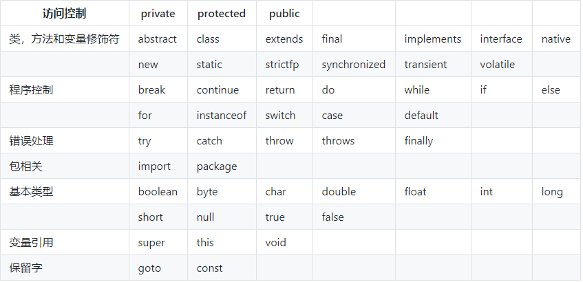

# 标识符 & 关键字

在我们编写程序的时候，需要大量地为程序、类、变量、方法等取名字，于是就有了标识符，简单来说，标识符就是一个名字。但是有一些标识符，Java 语言已经赋予了其特殊的含义，只能用于特定的地方，这种特殊的标识符就是关键字。因此，关键字是被赋予特殊含义的标识符。比如，在我们的日常生活中 ，“警察局”这个名字已经被赋予了特殊的含义，所以如果你开一家店，店的名字不能叫“警察局”，“警察局”就是我们日常生活中的关键字。

Java中常见的关键字：

# 标识符的命名规则
- 标识符由数字、字母、下划线、`$` 组成
- 不能以数字开头
- 不能和关键字或保留字相同

